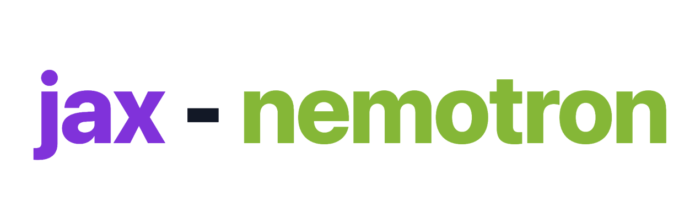

# jax-nemotron



A clean, hackable JAX / Flax-NNX re-implementation of NVIDIA's **Nemotron-3-Nano-Omni** model based on public pytorch model files and paper.

The backbone is a hybrid LLM: interleaved **Mamba-2** state-space mixers, **GQA attention**, and
**sparse-MoE** FFNs (the `"MEM*EM"`-style layer pattern). On top of that backbone sit a **vision
encoder** and a **sound encoder**, fused into the token stream by splicing encoder features into
placeholder positions in the input ids. It is small enough to read in an afternoon and runs on a
free Colab/Kaggle TPU (or CPU, via the `tiny` preset).

## Quickstart

```bash
git clone git@github.com:huckiyang/jax-nemotron.git
cd jax-nemotron

# CPU JAX venv (jax 0.10.1, flax 0.12.7 — the flax.nnx API)
python -m venv .venv && .venv/bin/pip install -U jax flax numpy ml_dtypes safetensors orbax-checkpoint

# Build the tiny model and run a forward pass on CPU
.venv/bin/python examples/run_tiny_cpu.py
```

There is no `pip install` of the package itself — it lives under `src/` and is imported by
prepending that dir to `sys.path`:

```python
import sys; sys.path.insert(0, "src")           # or the absolute path to src/
from flax import nnx
from jax_nemotron.config import NemotronHConfig
from jax_nemotron.nemotron_h import NemotronHModel

cfg   = NemotronHConfig.from_preset("tiny")      # 6 layers "MEM*EM", hidden=64, vocab=512, chunk_size=4
model = NemotronHModel(rngs=nnx.Rngs(0), config=cfg)
logits = model(token_ids)                        # (B, L) int ids -> (B, L, vocab); L % chunk_size == 0
```

Two presets exist: `"tiny"` (CPU/laptop) and `"omni_30b"` (the real 30B model — **do not** build it
on a laptop). `from_preset` defaults to `"omni_30b"`, so always pass `"tiny"` for local work.
`seqlen` must be divisible by `cfg.chunk_size` (4 for tiny) or the Mamba mixer raises `ValueError`.

Multimodal forward (vision + sound spliced into placeholder ids):

```python
from jax_nemotron.nemotron_omni import NemotronOmni, NemotronOmniConfig

cfg   = NemotronOmniConfig.from_preset("tiny")
model = NemotronOmni(config=cfg, rngs=nnx.Rngs(0))   # NOTE: config first here; rngs is first on NemotronHModel

# pixel_values are channels-LAST (B, H, W, C); waveform is raw (B, T)
n_vis = model.encode_vision(pixel_values).shape[1]   # measure encoder token counts first
n_aud = model.encode_sound(waveform).shape[1]
# place img_context_token_id (18) and sound_context_token_id (27) in input_ids at those slots,
# pad L up to a multiple of cfg.llm.chunk_size, then:
logits = model(input_ids, pixel_values=pixel_values, waveform=waveform)   # (B, L, vocab)
# text-only is also valid: model(input_ids)
```

See `examples/run_tiny_cpu.py` for the full runnable version of both.

## Run the gates

The repo has no pytest dependency — the tests are standalone scripts. Run them from the repo root
with the venv python:

```bash
.venv/bin/python tests/test_shape_gate.py        # tiny LLM forward: 49 leaves, logits (2, 8, 512)
.venv/bin/python tests/test_omni_shape.py        # fused omni forward: logits (2, 20, 512)
.venv/bin/python tests/test_name_coverage.py     # HF -> nnx name map is a full bijection
.venv/bin/python tests/test_converter_units.py   # converter leaf transforms (reshape/transpose/dtype)
```

## HF safetensors -> Orbax checkpoint

`scripts/convert_hf_to_orbax.py` is a **target-driven** converter. It first builds the authoritative
param tree from *our* model via `nnx.eval_shape` (no allocation), flattens it to slash paths
(e.g. `layers/3/mixer/in_proj/kernel`), then walks the HF safetensors and maps each tensor onto that
target with `hf_name_map(cfg)`. Every leaf is cast to `bfloat16`. The mapping must be a full
bijection over `language_model.*` — if anything is unmapped on either side, the converter exits
non-zero. Output is written with an Orbax `StandardCheckpointer` under a top-level `"params"` key,
straight to the final destination.

```bash
.venv/bin/python scripts/convert_hf_to_orbax.py \
  --ckpt-dir <HF_DIR> --out <OUT_DIR> --preset omni_30b --dtype bf16 --dry-run
```

Flags: `--ckpt-dir` (required), `--out` (required), `--preset` (`omni_30b` or `tiny`, default
`omni_30b`), `--dtype` (only `bf16` accepted), `--dry-run` (reads/transforms/asserts every leaf but
skips the Orbax write — use it to validate coverage before committing a real conversion).

## Architecture

| File (`src/jax_nemotron/`) | What it is |
| --- | --- |
| `config.py`         | `NemotronHConfig` + presets, layer-pattern parsing, `MIXER_MAMBA/ATTENTION/MOE` tokens, `validate()`. |
| `mamba_2.py`        | Mamba-2 SSD mixer (chunked scan; seqlen must divide `chunk_size`). |
| `attention.py`      | GQA self-attention block. |
| `moe.py`            | Sparse MoE FFN: fine-grained routed experts + always-on shared experts. |
| `nemotron_h.py`     | `NemotronHModel` LLM backbone wiring the mixers per layer pattern; `hf_name_map`, `HF_PREFIX`. |
| `vision_encoder.py` | `VisionEncoder` (+ `VisionEncoderConfig`), channels-last image input. |
| `audio_encoder.py`  | `AudioEncoder` (+ `AudioEncoderConfig`), raw-waveform input with subsampling. |
| `nemotron_omni.py`  | `NemotronOmni` (+ `NemotronOmniConfig`): encodes modalities, splices features into placeholder ids, runs the LLM. |

Public package exports (`jax_nemotron/__init__.py`) are `NemotronHConfig`, `NemotronOmni`,
`NemotronOmniConfig`. `NemotronHModel`, `hf_name_map`, and the mixer classes are imported from their
submodules (`jax_nemotron.nemotron_h`).

## Status

Milestone 1 (**LLM backbone**) is complete: the HF→nnx name map is a verified full bijection,
**401/401** language-model leaves matched against the real checkpoint index. Multimodal
conversion (vision + sound encoders) is milestone 2.
